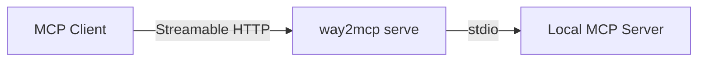
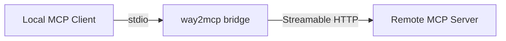

# way2mcp

[中文](./README.zh-CN.md)

## Changelog

### [1.1.0] - 2026-05-03

- **Breaking Change**: Completely removed legacy SSE and WebSocket transport support.
- **Breaking Change**: Now focusing exclusively on the official **Streamable HTTP** transport for remote connections, ensuring maximum protocol compliance and performance.
- **Internal**: Refactored `HttpBridge` to be cleaner and more robust using modern SDK patterns.

<details>
<summary>Older Versions</summary>

### [1.0.5] - 2026-05-03

- **Fix**: Corrected JSON-RPC response formatting in bridge mode (fixed missing `result` wrapper).

### [1.0.4] - 2026-05-03

- **Fix**: Perfect proxy of all MCP capabilities (tools, prompts, resources) from remote to local client.
- **Fix**: Corrected extraction of server capabilities from the SDK client.

### [1.0.3] - 2026-05-03

- **Fix**: Bridge mode now handles `initialize` locally instead of double-forwarding, preventing timeout and stdin close race conditions.
- **Fix**: Bridge captures and proxies remote server capabilities to the local MCP client.

### [1.0.2] - 2026-05-03

- **Fix**: Mandatory Session ID for Streamable HTTP (fixes protocol violation in stateless mode where subsequent requests were rejected).
- **Fix**: Improved session management for better reliability.

### [1.0.1] - 2026-05-03

- **Fix**: Improved `initialize` request handling for better compatibility (fixes 400 Bad Request / Invalid request error).
- **Fix**: Enhanced resilience of the Streamable HTTP server transport.
- **Internal**: Refactored server code for better maintainability and reduced cognitive complexity.
- **Internal**: Added detailed debugging logs for `/mcp` requests.

</details>

A transport bridge for the [Model Context Protocol (MCP)](https://modelcontextprotocol.io). Connect MCP servers and clients across different transports — stdio and Streamable HTTP — with a single command.

## What is way2mcp?

way2mcp solves a common problem in the MCP ecosystem: **your MCP client and server speak different transports**.

- Have a stdio-only MCP server but need to expose it over the network? Use **`serve`**.
- Have a remote HTTP MCP server but your client only supports stdio? Use **`bridge`**.

**serve mode**



**bridge mode**



## Features

- **Two modes**: `serve` (stdio → network) and `bridge` (network → stdio)
- **Streamable HTTP** as the transport (MCP spec compliant)
- **Stateful & stateless** session management
- **CORS** support with origin filtering and regex matching
- **Custom headers** and OAuth2 Bearer token authentication
- **Health endpoint** for monitoring and load balancers
- **Zero config**: sensible defaults, works out of the box

## Installation

```bash
# Global install
npm install -g way2mcp

# Or use directly with npx (no install needed)
npx way2mcp serve --cmd "your-mcp-server"
```

### Requirements

- Node.js >= 18

## Quick Start

### Expose a local stdio server over HTTP

```bash
way2mcp serve --cmd "uvx mcp-server-git"
```

This starts an HTTP server on port 8000 (default). MCP clients connect to `http://localhost:8000/mcp`.

### Connect to a remote MCP server via stdio

```bash
way2mcp bridge --url "https://example.com/mcp"
```

This connects to the remote server and bridges all traffic through stdin/stdout, making it compatible with stdio-only MCP clients.

## Usage

### `serve` — Expose a stdio MCP server over the network

```bash
way2mcp serve --cmd <command> [options]
```

The `serve` command spawns your MCP server as a child process, communicates with it via stdio (stdin/stdout), and exposes it as a Streamable HTTP endpoint.

#### How it works

1. way2mcp starts an Express HTTP server
2. When a client sends an MCP `initialize` request, way2mcp spawns your `--cmd` process
3. All JSON-RPC messages are proxied between the HTTP transport and the child process's stdio
4. In stateful mode, each client session gets its own isolated child process
5. When the session ends, the child process is cleaned up

#### Options

| Option              | Type                        | Default        | Description                                                                                                                                         |
| ------------------- | --------------------------- | -------------- | --------------------------------------------------------------------------------------------------------------------------------------------------- |
| `--cmd`             | string                      | **(required)** | Command to spawn the MCP stdio server                                                                                                               |
| `--port`            | number                      | `8000`         | HTTP listen port                                                                                                                                    |
| `--stateful`        | boolean                     | `false`        | Enable stateful sessions (one child process per client)                                                                                             |
| `--session-timeout` | number                      | —              | Session timeout in milliseconds (stateful mode only)                                                                                                |
| `--cors`            | string[]                    | —              | Allowed CORS origins. Use `--cors "*"` for all, or `--cors "https://example.com"` for specific origins. Supports regex: `--cors "/example\\.com$/"` |
| `--header`          | string[]                    | —              | Custom response headers (repeatable)                                                                                                                |
| `--oauth2-bearer`   | string                      | —              | OAuth2 Bearer token (sets `Authorization: Bearer <token>` header)                                                                                   |
| `--health`          | string                      | `/healthz`     | Health check endpoint path                                                                                                                          |
| `--log-level`       | `debug` \| `info` \| `none` | `info`         | Logging verbosity                                                                                                                                   |

#### Examples

```bash
# Basic: expose a stdio server as Streamable HTTP
way2mcp serve --cmd "uvx mcp-server-git" --port 8000

# Stateful mode: each client gets an isolated session
way2mcp serve --cmd "uvx mcp-server-git" --stateful

# Allow cross-origin requests from any domain
way2mcp serve --cmd "node server.js" --cors "*"

# Allow specific origins with regex matching
way2mcp serve --cmd "node server.js" --cors "/\\.example\\.com$/"

# Add custom headers and OAuth2 authentication
way2mcp serve --cmd "uvx mcp-server-git" \
  --header "X-Tenant-Id: abc123" \
  --oauth2-bearer "your-access-token"

# Debug mode with verbose logging
way2mcp serve --cmd "uvx mcp-server-git" --log-level debug

# Custom health endpoint
way2mcp serve --cmd "uvx mcp-server-git" --health "/status"
```

### `bridge` — Connect to a remote MCP server via stdio

```bash
way2mcp bridge --url <url> [options]
```

The `bridge` command connects to a remote MCP server over the network and exposes it locally via stdin/stdout. This makes remote MCP servers compatible with clients that only support stdio transport.

#### How it works

1. way2mcp starts and connects to the remote MCP server (Streamable HTTP)
2. Reads JSON-RPC messages from stdin (sent by the local MCP client)
3. Forwards them to the remote server and writes responses to stdout

#### Options

| Option            | Type                        | Default        | Description                                                       |
| ----------------- | --------------------------- | -------------- | ----------------------------------------------------------------- |
| `--url`           | string                      | **(required)** | Remote MCP server URL (Streamable HTTP endpoint)                  |
| `--header`        | string[]                    | —              | Custom headers to send with requests (repeatable)                 |
| `--oauth2-bearer` | string                      | —              | OAuth2 Bearer token (sets `Authorization: Bearer <token>` header) |
| `--log-level`     | `debug` \| `info` \| `none` | `info`         | Logging verbosity                                                 |

#### Examples

```bash
# Connect to a Streamable HTTP server
way2mcp bridge --url "http://localhost:8000/mcp"

# Connect to a remote server with authentication
way2mcp bridge --url "https://mcp.example.com/mcp" --oauth2-bearer "token123"

# Connect with custom headers
way2mcp bridge --url "https://mcp.example.com/mcp" \
  --header "X-API-Key: secret" \
  --header "X-Tenant: abc"

# Debug mode to see transport auto-detection
way2mcp bridge --url "https://mcp.example.com/mcp" --log-level debug
```

## MCP Client Configuration

### Claude Code

Add way2mcp to your Claude Code MCP configuration (`~/.claude.json`):

```json
{
  "mcpServers": {
    "my-remote-server": {
      "command": "way2mcp",
      "args": ["bridge", "--url", "https://mcp.example.com/mcp"],
      "env": {}
    }
  }
}
```

Or expose a local stdio server for network access:

```json
{
  "mcpServers": {
    "git-tools": {
      "command": "way2mcp",
      "args": ["serve", "--cmd", "uvx mcp-server-git", "--port", "8000"],
      "env": {}
    }
  }
}
```

### Claude Desktop

Add to your Claude Desktop config (`claude_desktop_config.json`):

```json
{
  "mcpServers": {
    "remote-server": {
      "command": "way2mcp",
      "args": [
        "bridge",
        "--url",
        "https://mcp.example.com/mcp",
        "--oauth2-bearer",
        "your-token"
      ]
    }
  }
}
```

### Any MCP Client (via .mcp.json)

Create a `.mcp.json` in your project root:

```json
{
  "mcpServers": {
    "my-server": {
      "type": "http",
      "url": "http://localhost:8000/mcp"
    }
  }
}
```

Then start way2mcp serve in the background:

```bash
way2mcp serve --cmd "your-mcp-server" --port 8000
```

## Transport Support Matrix

| Transport       | serve (input → output) | bridge (input → output) |
| --------------- | :--------------------: | :---------------------: |
| stdio           |         input          |         output          |
| Streamable HTTP |         output         |          input          |

## Architecture

**serve mode**


**bridge mode**


## Development

```bash
git clone https://github.com/nicepkg/way2mcp.git
cd way2mcp
npm install
npm run build     # compile TypeScript
npm test          # run integration tests
```

### Project Structure

```
src/
  index.ts              # CLI entry point (serve / bridge subcommands)
  server.ts             # Express serve mode
  bridge.ts             # Bridge mode (network → stdio)
  types.ts              # Shared type definitions
  gateways/
    stdio-bridge.ts     # StdioBridge: spawns child process, proxies JSON-RPC
    http-bridge.ts      # HttpBridge: connects to remote Streamable HTTP server
  lib/
    logger.ts           # Logger factory (debug/info/none)
    headers.ts          # Header parsing (with OAuth2 support)
    cors.ts             # CORS origin parsing (wildcard, regex, string)
    session.ts          # Session access counter with timeout
    signals.ts          # Graceful shutdown (SIGINT/SIGTERM/SIGHUP)
    version.ts          # Reads version from package.json
tests/
  serve.test.ts         # Serve mode integration tests
  bridge.test.ts        # Bridge mode integration tests
  auto-detect.test.ts   # Transport auto-detection tests
```

## License

MIT
